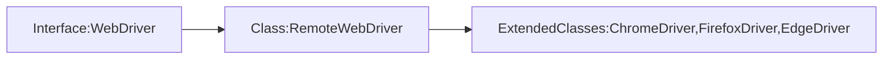

# Selenium Interview Questions

## Selenium WebDriver 
  
1. WebDriver is one of the component in selenium  
  
2. Webdriver is a java interface  
  
3. WebDriver is an API  



## Explain the java concepts and OOPS used in your automation  
      
 1. First we use inheritance for extending the properties of BaseTest to each of our test scripts .
 2. Abstraction for many utilities where we are calling and not focusing much on the implementation of the package .
 3. In Utility itself we have used overloading as well for actions like to select by id for a dropdown or by visible text .
 4. In pom file we are using encapsulation as well as we have defined all the web element as private and setting the class as public keeping all the setters method to use those web elements inside our test script

## Difference between ChromeDriver and WebDriver
  
ChromeDriver is class and WebDriver is interface. Initialising the driver as WebDriver is more flexible as you can switch between browsers and also promotes polymorphism

## Locators
      
**General Locators -** id, name, linktext and partiallinktext , class name and tag name.  
      
**Customised locators -** css selector , xpath  

```
driver.findElement(By. id(‘tested)) - By id  
```
```
driver.findElement(By. name(‘tested)) - By name  
```  
```
WebElement element = driver.findElement(By.tagName("input"));
```
```
driver.findElement(By. linkText(‘tested)) - By linkText ( Used for a tags to be picked. 
This value passed is the text inside the a tag like <a href = “/“>tested</a> 
```
```
driver.findElement(By. partiallinkText(‘test’)) - By partialLinkText ( Used for a tags to be picked with a partial text of the value. 
This value passed is the text inside the a tag like <a href = “/“>tested</a>
```
**Note:** TagName and Class are used to locate a group of elements.  
``` 
List <WebElement> elements = driver.findElements(By. tagName(‘img’)) - By TagName 
``` 
```
List <WebElement> elements = driver.findElements(By. className(‘img’)) - By className 
```    
We can store multiple elements into set or list. We prefer list as there can be duplicates while getting the elements and we want all the elements. Set will remove the duplicates.
   
**Note:** Locator not matching with elements in findElements and findElement  

```  
findElements(loc) -> No Such Element Exception  
```      
```
findElements(loc) -> returns []
```
 CSS Selectors  
1. Tag id -> tag#id  
2. Tag class -> tag.classname  
3. Tag attribute -> tag[attribute=“value”]  
4. Tag class attribute -> tag.classname[attribute=“value”]     
     
**Syntaxes -**  
      
Tag id:  
```
driver.findElement(By.cssSelector(“input#small-searchterms”)).sendKey(“test”);  
```
We can even do this with just #small-searchterms as id is always unique and put the # always  

Tag class:  
```
driver.findElement(By.cssSelector(“input.testCssSelector”)).sendKey(“test”);  
```
Tag attribute: 
```
driver.findElement(By.cssSelector(“input[name=“testInput”]”)).sendKey(“test”);
 ```
We can do this also - 
```
driver.findElement(By.cssSelector(“[name=“testInput”]”)).sendKey(“test”);
```
Tag class attribute:  
```
driver.findElement(By.cssSelector(“input.search-box-text[name=“testInput”]”)).sendKey(“test”); 
``` 
We can do this also - 
```
driver.findElement(By.cssSelector(“.search-box-text[name=“testInput”]”)).sendKey(“test”);
```
## Selector Hub

Extension for making x-paths

## Xpaths  
      
1. Absolute - /html/body/header/div/div/input  
2. Relative - //input[@name=“check”]  
      
Disadvantage of Absolute path is if developer adds or remove any element from the hierarchy in DOM ( Document Object Model ). The Absolute path would fail.  

Absolute path starts with / and Relative path starts with //  
Absolute path does not use attributes, relative path use attributes

## Path with ‘and’ and ‘or’ operator  
      
//input[@name=‘search’ and @placeholder=‘Search’]  
      
//input[@name=‘search’ or @placeholder=‘Search’]

## Path with text() - Inner text  

//a[text()=‘Desktops’]  

**Only works when we have a inner-text for the tag**

## Path with contains() and starts-with  
      
//input[contains(@placeholder,’Sea’)]  
      
//input[starts-with(@ ,’Sea’)]

## Ancestor, parent, following-sibling, preceding-sibling, child and descendant.  
      
Taken screenshot of a tree structure image for the same on 10th Oct 2024  
      
Ancestor -> grand parent  
Descendant -> grand child  
Preceding sibling -> left sibling  
Following sibling -> Right sibling  
      
      
**Syntaxes -**  
      
Parent :  
```
//input[@id=‘texUsername’]/parent::’form’  
```
```
//input[@id=‘texUsername’]/parent::*  
```
```
//input[@id=‘texUsername’]/..  
```
Child:  
```
//input[@id=‘texUsername’]/child::’input’  
```
```
input[@id=‘texUsername’]/input  
```
Descendant:  
```
//form/*/input  
//form/div/input  
//form[@id=‘fromLogin’]//input  
```
Also if Dom is div/div/div/a/input and you want to access the last input. You can do -  
```
//div//input - this // will find the latest input below div ignoring all middle elements  
```
If Dom is -  
```
div  
    |- div  
    |—-div  
    |—-div  
    |—-div -> want to access this  
```
I want to select the 3rd div then -  
```
//div/div/div[3]  
```
We also have last() and first()  
```
//div/div/div[last()]  
```
Ancestor:  
```
//input[@id=‘texUsername’]/ancestor::form -> will select the form element  
```
```
/input[@id=‘texUsername’]/ancestor::* -> will select the html tag which is the very last parent of all components  
```
Dom is form/div/input

##  Looping between elements  
      
```
List <WebElement> eles = driver.findElements(By.xpath(“//input[@name=“test” and @placeholder=“test2”]”)  
for(int I=0;i<eles.size();I++  
    {  
    eles. get(i).click()  
    }  
for(WebElement e: else)  
    {  
    e.click()  
    }
```

## To navigate to an url in Selenium we can use -  
  
driver.navigate().to(baseUrl + route)

## Soft Assertions  
  
 It’s a module of TestNG  
 
 ``` 
import org.testng.asserts.SoftAssert;  
  
SoftAssert softAssert = **new** SoftAssert();  
  
softAssert.assertEquals(actualRersult,expectedResult,"Title is not Matching");
```
  
Soft Assertions are assertions which does not cause test termination in case failed. The test will be marked failed but the test would be executed further.

## Select Checkboxes  
```
driver.findElement(By.xpath(“//input[@id=‘sunday’]”)).click();  
```     
For multiple checkboxes  
```
List<WebElement> eles = driver.findElements(By.xpath(“//input[@class=‘checkbox-class’ and @type=‘checkbox’”));  
for(WebElement ele: eles)  
    {  
    ele.click();  
    }
```

## Alerts and Dialog boxes  
 
 ``` 
WebDriver driver = new ChromeDriver();  
  
driver.get("https://www.example.com");  
  
// Find the element that triggers the alert  
WebElement element = driver.findElement(By.id("yourElementId"));  
  
element.click();  
  
  
// Handle the alert  
Alert alert = driver.switchTo().alert();  
String alertText = alert.getText();  
System.out.println("Alert text: " + alertText);  
  
// Send text to the prompt  
alert.sendKeys("Your text here");  
  
  
// Accept or dismiss the alert  
alert.accept(); // Or alert.dismiss();
```

## GetWindowHandles  
```
    import java.util.Iterator;  
    import java.util.Set;  
    import org.openqa.selenium.By;  
    import org.openqa.selenium.WebDriver;  
    import org.openqa.selenium.chrome.ChromeDriver;  
      
    public class WindowHandle_Demo {  
    public static void main(String[] args) throws Exception {  
      
    System.setProperty("webdriver.chrome.driver","Path to the driver");  
    WebDriver driver = new ChromeDriver();  
      
    driver.manage().window().maximize();  
      
    // Load the website  
    driver.get("http://www.naukri.com/");  
      
    // It will return the parent window name as a String  
    String parent=driver.getWindowHandle();  
      
    Set<String>s=driver.getWindowHandles();  
      
    // Now iterate using Iterator  
    Iterator<String> I1= s.iterator();  
      
    while(I1.hasNext())  
    {  
      
    String child_window=I1.next();  
      
      
    if(!parent.equals(child_window))  
    {  
    driver.switchTo().window(child_window);  
      
    System.out.println(driver.switchTo().window(child_window).getTitle());  
      
    driver.close();  
    }  
      
    }  
      
    //switch to the parent window  
    driver.switchTo().window(parent);  
      
    }  
    }
  ```
  
##  Mouse Click  

```
  
import org.openqa.selenium.By;  
import org.openqa.selenium.WebDriver;  
import org.openqa.selenium.WebElement;  
import org.openqa.selenium.chrome.ChromeDriver;  
import org.openqa.selenium.interactions.Actions;  
  
public class MouseClickExample {  
public static void main(String[] args) {  
System.setProperty("webdriver.chrome.driver", "path/to/chromedriver");  
WebDriver driver = new ChromeDriver();  
  
driver.get("https://www.example.com");  
  
WebElement elementToClick = driver.findElement(By.id("yourElementId"));  
  
Actions actions = new Actions(driver);  
ac.moveToElement(elementToClick).click().perform();  
  
// Close the browser  
driver.quit();  
}  
}  

```
  
Mouse Actions in Selenium:  

**doubleClick()**: Performs double click on the element  
**clickAndHold()**: Performs long click on the mouse without releasing it  
**dragAndDrop(source, target)**: Drags the element from one point and drops to another.  
**moveToElement()**: Shifts the mouse pointer to the center of the element  
**contextClick()**: Performs right-click on the mouse  
  
**Keyboard Actions in Selenium:**  
  
**sendKeys()**: Sends a series of keys to the element  
**keyUp()**: Performs key release  
**keyDown()**: Performs keypress without release

## How to handle a dialog box of javascript asking for username and password  

```  
// Switch to the alert dialog  
Alert alert = driver.switchTo().alert();  
  
// Enter the username and password  
alert.sendKeys("yourUsername" + Keys.TAB + "yourPassword");  
  
// Accept the alert to log in  
alert.accept();
```

## Upload Multiple files in Selenium  
  
 ```
// Locate the file input element  
WebElement uploadElement = driver.findElement(By.xpath("//input[@type='file']"));  
  
// Specify the file paths to upload (comma-separated string)  
uploadElement.sendKeys("C:/path/to/file1.txt" + "\n" + "C:/path/to/file2.txt" + "\n" + "C:/path/to/file3.txt");
```

In case the html tag doesn’t have multiple attribute  
```
// Locate the file input element  
WebElement uploadElement = driver.findElement(By.xpath("//input[@type='file']"));  
```
``` 
// List of file paths to upload  
String[] filePaths = {"C:/path/to/file1.txt", "C:/path/to/file2.txt", "C:/path/to/file3.txt"};  

for (String filePath : filePaths) {  
uploadElement.sendKeys(filePath);  // Upload each file  
}
```

## Dropdowns in Selenium  

``` 
import org.openqa.selenium.By;  
import org.openqa.selenium.WebDriver;  
import org.openqa.selenium.WebElement;  
import org.openqa.selenium.chrome.ChromeDriver;  
import org.openqa.selenium.support.ui.Select;  
  
public class DropdownExample {  
public static void main(String[] args) {  
System.setProperty("webdriver.chrome.driver", "path/to/chromedriver");  
WebDriver driver = new ChromeDriver();  
  
driver.get("https://www.example.com"); // Replace with the URL of the webpage  
  
WebElement dropdownElement = driver.findElement(By.id("yourDropdownId"));  
  
Select select = new Select(dropdownElement);  
  
// Select an option by value  
select.selectByValue("optionValue");  
  
// Select an option by visible text  
select.selectByVisibleText("Option Text");  
  
// Select an option by index  
select.selectByIndex(1); // Selects the second option  
}  
}
```

## Scroll in Selenium  
  
```
Actions actions = new Actions(driver); actions.moveToElement(elementToScrollTo).perform();  
  
JavaScript Executor approach  
  
JavascriptExecutor js = (JavascriptExecutor) driver;  
  
js.executeScript("window.scrollTo(0, document.body.scrollHeight);");  
  
// Scroll to the bottom of the page  
  
js.executeScript("window.scrollTo(0, 0);");  
  
  
Horizontal Scroll -  
  
JavascriptExecutor js = (JavascriptExecutor) driver;  
  
js.executeScript("window.scrollBy(200, 0);");
```
